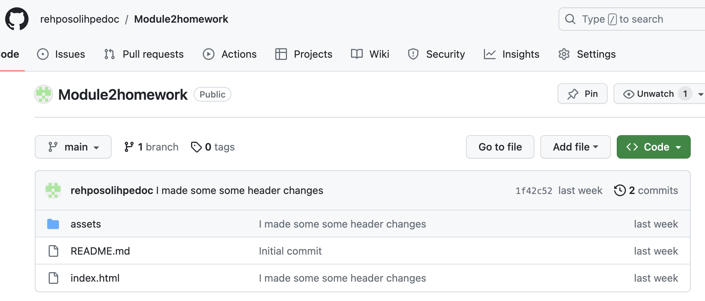

# Module2homework (About-Me Page for portfolio)
## Description
- I wanted to create a webpage that will be a foundation for my future portfolio.
- This project will open up opportunities for future employment and collaboration.
- The problem of not having a professional web page to showcase my work is now solved.
- I learned how all the fundementals of CSS and HTML have to work together to produce an amazing page. Planning is the key to execution. By drawinging out a framework by hand I made my dream into reality.
## Installation
- IDE: VS-CODE
- Markup language: HTML
- Programming Language: CSS
## Usage

## Credits
- https://www.w3schools.com/css/css_grid.asp
- flexbox https://www.youtube.com/watch?v=qXRYMdvq_Dc

## License
MIT License

Copyright (c) [2023] [Yemi Ayeni]

Permission is hereby granted, free of charge, to any person obtaining a copy
of this software and associated documentation files (the "Software"), to deal
in the Software without restriction, including without limitation the rights
to use, copy, modify, merge, publish, distribute, sublicense, and/or sell
copies of the Software, and to permit persons to whom the Software is
furnished to do so, subject to the following conditions:

The above copyright notice and this permission notice shall be included in all
copies or substantial portions of the Software.

THE SOFTWARE IS PROVIDED "AS IS", WITHOUT WARRANTY OF ANY KIND, EXPRESS OR
IMPLIED, INCLUDING BUT NOT LIMITED TO THE WARRANTIES OF MERCHANTABILITY,
FITNESS FOR A PARTICULAR PURPOSE AND NONINFRINGEMENT. IN NO EVENT SHALL THE
AUTHORS OR COPYRIGHT HOLDERS BE LIABLE FOR ANY CLAIM, DAMAGES OR OTHER
LIABILITY, WHETHER IN AN ACTION OF CONTRACT, TORT OR OTHERWISE, ARISING FROM,
OUT OF OR IN CONNECTION WITH THE SOFTWARE OR THE USE OR OTHER DEALINGS IN THE
SOFTWARE.

## Badges

